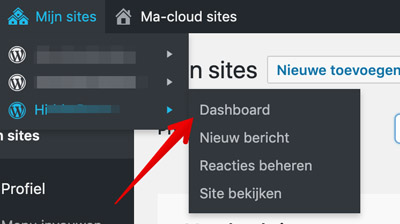
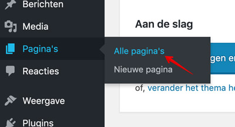
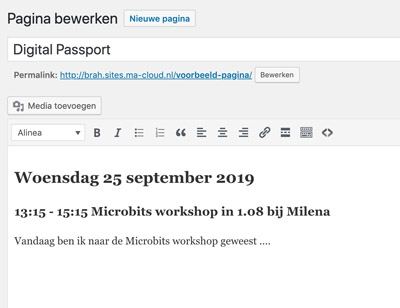
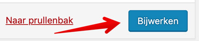
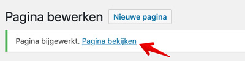
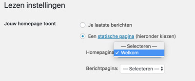
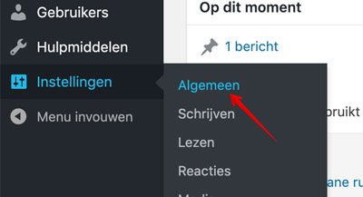
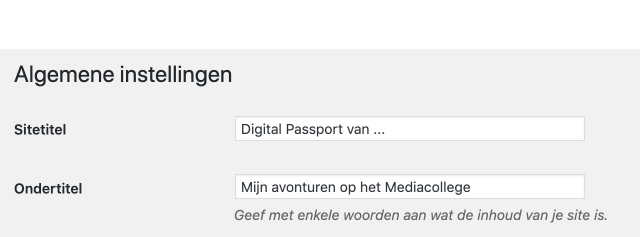
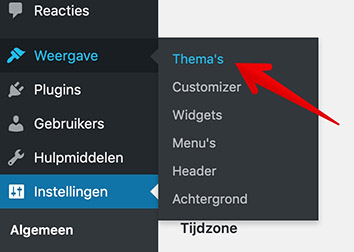
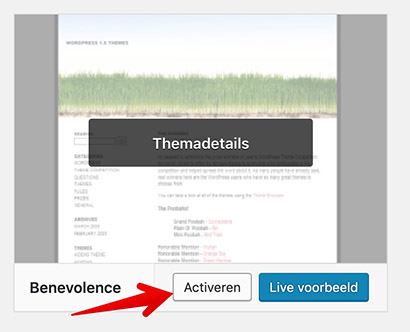

## Digital Passport / Persoonlijk blog

### Heb je nog geen blog?

Ga naar [http://sites.ma-cloud.nl/wp-login.php](http://sites.ma-cloud.nl/wp-login.php) en log in met je *studentnummer* en *wachtwoord*.  
Er wordt automatisch een Wordpress blog voor je aangemaakt (je Digital Passport)
  
Het adres van je blog is: `http://<studentnummer>.sites.ma-cloud.nl`

### Inloggen op je blog
Inloggen kan via `http://<studentnummer>.sites.ma-cloud.nl/wp-login.php`

### Blog pagina
Als je bent ingelogd zie je bovenin je blog een balk. Klap die open en ga naar je `Dashboard`.  
Hier kun je pagina's toevoegen, bewerken enzovoorts.

---

Klik op `Dashboard` en ga naar `Alle pagina's` in het linker menu.

Klik op `Bewerken` om de pagina aan te passen.

---

Dit wordt de pagina waar je je verslag schrijft. Schrijf voor elke DIFF activiteit, workshop of les een verslagje.  
Maak gebruik van koppen en subkoppen om het netjes en overzichtelijk te maken.

---

Vergeet niet om je wijzigingen op te slaan:

---

Bekijk je wijzigingen door naar je blog te gaan:

## Je pagina als homepage instellen

Ga naar `Instellingen -> Lezen`. Selecteer de optie `Een statische pagina`"` en kies de pagina die je als homepage wilt.

 

## De titel van je blog aanpassen
Standaard wordt je blog: '12345's Blog' genoemd, dat is niet zo mooi.  
Ga naar `Instellingen -> Algemeen`  en verander de titel:

 

## Andere vormgeving kiezen
Je kunt een andere vormgeving kiezen. Ga naar `Weergave -> Thema's` en probeer en activeer een ander thema:

 

 